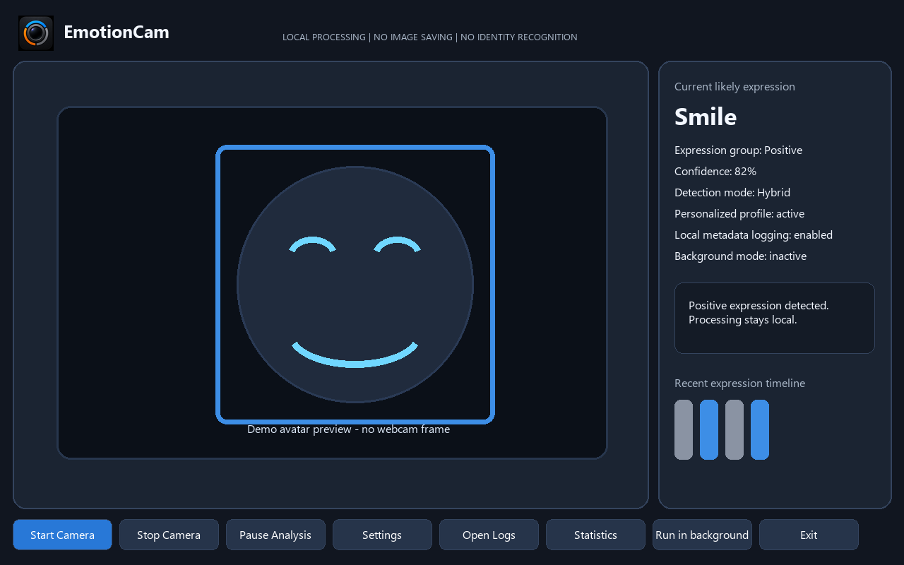

# EmotionCam


EmotionCam is a Windows desktop app that estimates visible facial expressions
from a webcam feed. It is built with Python, PySide6, OpenCV, and MediaPipe, and
it is designed for one person using a built-in laptop webcam. Version 1.1.1 adds
optional external AI analysis, but the app remains local-first and AI is off
until the user enables it, accepts the warning, and provides an API key.

EmotionCam estimates visible expressions only. It does not know true emotions,
diagnose mood or mental state, identify people, or perform face matching.



## Download and install EmotionCam

Installer binaries are distributed through GitHub Releases, not committed into
the source repository.

1. Open the repository Releases page:
   [github.com/silviu-cristian/EmotionCam/releases](https://github.com/silviu-cristian/EmotionCam/releases)
2. Download the installer for the version you want.
3. Double-click the installer and follow the prompts.
4. Launch EmotionCam from the Start Menu or the optional desktop shortcut.
5. If Windows SmartScreen appears because the app is unsigned, choose
   **More info > Run anyway** only if you trust the downloaded file.

The app installs per user under:

```text
%LOCALAPPDATA%\Programs\EmotionCam
```

Uninstall it from **Windows Settings > Apps > Installed apps > EmotionCam**.

## Releases

### v1.0.0 - Local-only release

- Fully local visible-expression estimation.
- No external AI analysis.
- Best for privacy-focused or offline use.
- Installer asset: `EmotionCam_Setup.exe`.

### v1.1.1-ai - Recommended AI-enabled release

- Keeps all local detection features.
- Adds optional **External AI Analysis** using OpenAI vision through the
  Responses API.
- Disabled by default.
- Requires explicit consent and an OpenAI API key.
- Can send cropped face images by default, or selected full frames only if the
  user changes that setting.
- Falls back to local detection when no key, no consent, no face, timeout, or
  API error occurs.
- Includes the AI-mode activation hotfix so enabling External AI selects
  Hybrid local + AI mode automatically.
- Installer asset: `EmotionCam_Setup_v1.1.1_AI.exe`.

### v1.1.0-ai - Earlier AI-enabled release

- First AI-enabled release.
- Kept available for history, but `v1.1.1-ai` is recommended.

## Which version should I download?

Choose **v1.0.0 Local-only** if privacy/offline use matters most and you do not
want any external AI option in the app.

Choose **v1.1.1-ai AI-enabled** if you want the same local app plus optional
stronger AI-assisted visible-expression analysis, and you accept the privacy
tradeoff when External AI is explicitly enabled.

## Project files

The application source is in the [`emotioncam/`](emotioncam/) folder.

Useful links:

- [Main project README](emotioncam/README.md)
- [User manual](emotioncam/docs/user_manual.html)
- [Start demo guide](emotioncam/docs/START_DEMO_HERE.html)
- [Presenter script](emotioncam/docs/demo_script.md)
- [Screenshot checklist](emotioncam/docs/screenshot_checklist.md)

## Privacy summary

- Webcam processing is local by default.
- External AI analysis is off by default and never sends images without
  explicit consent plus an API key.
- No telemetry, analytics, accounts, identity recognition, or face matching.
- Logs contain expression metadata only, never webcam frames.
- Calibration stores local feature data and labels.
- Optional daily email summaries are off by default and send text only.
- Raw calibration images are saved only if the explicit debugging option is
  enabled.

## Run from source

```powershell
cd emotioncam
py -3.12 -m venv .venv
.\.venv\Scripts\Activate.ps1
python -m pip install --upgrade pip
python -m pip install -r requirements.txt
python -m app.main
```

## Test

```powershell
cd emotioncam
python -m pytest
```

## Build a release installer

```powershell
cd emotioncam
python build_exe.py
& "C:\Program Files (x86)\Inno Setup 6\ISCC.exe" installer\emotioncam.iss
```

The packaged app folder is generated at `emotioncam\release\app\EmotionCam`.
The AI-enabled installer is generated at:

```text
emotioncam\release\EmotionCam_Setup_v1.1.1_AI.exe
```

Do not commit the generated installer. Attach it to a GitHub Release instead.
