# EmotionCam User Manual

## 1. Cover Page


**EmotionCam**  
*Local visible-expression estimates, with privacy-first personalized calibration*  
Version 1.0.0 | Updated June 15, 2026

> EmotionCam estimates visible facial expressions. It does not know or guarantee a person's true emotions.

## 2. Introduction

EmotionCam is a Windows desktop app for one person using a laptop webcam. It processes the live preview locally, estimates visible facial expressions, and presents a smoothed label, group, confidence estimate, interaction message, and timeline.

The app can learn the user's visible facial movements through personalized calibration, run locally in the Windows system tray, and optionally save metadata-only expression history.

## 3. Privacy and Safety

- Webcam processing is local. The current implementation has no cloud calls.
- EmotionCam does not identify people or perform face matching.
- There is no account, telemetry, analytics, automatic screenshot, or video-recording feature.
- Optional logs contain timestamps, visible-expression labels/groups, confidence, status, messages, popup status, and FPS.
- Calibration stores normalized landmark feature vectors and labels locally.
- Raw calibration frames are **not** saved unless **Store raw calibration images for debugging** is explicitly enabled.
- The disabled External AI agent option is a future placeholder and cannot send frames.

> **Do not use EmotionCam for medical, psychological, legal, hiring, security, surveillance, or lie-detection decisions.**

## 4. Installation

### Install the packaged app

1. Open `EmotionCam-Setup-1.0.0.exe`.
2. Complete the per-user installer.
3. Choose the optional desktop shortcut if desired.
4. Launch EmotionCam from the Start Menu or desktop shortcut.

The installer uses the simplified smiling camera-lens icon for the installer, executable, shortcuts, taskbar, and tray.

### Run from source

```powershell
cd "C:\path\to\AI webcam emotion detector\emotioncam"
py -3.12 -m venv .venv
.\.venv\Scripts\Activate.ps1
python -m pip install --upgrade pip
python -m pip install -r requirements.txt
python -m app.main
```

Allow camera access for desktop apps in Windows Settings. Close Camera, Teams, Zoom, browser calls, and other apps using the webcam.

## 5. First Launch

The startup screen shows the local-processing privacy notice and approximation notice. **Save local expression metadata history** is enabled by default but can be disabled before starting.

- **Start Camera** saves the logging choice, opens the dashboard, and starts the webcam.
- **Settings** opens configuration before starting.
- **Exit** closes EmotionCam.
- **Help > Start Demo Guide** opens the offline demo page.

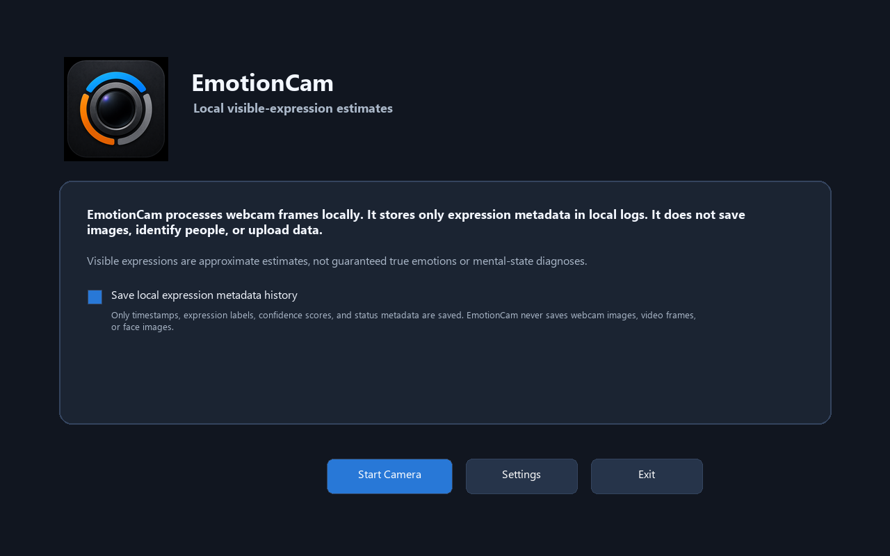

> **Placeholder screen example:** capture the real startup screen as `docs/screenshots/01_startup_screen.png`.

## 6. Main Dashboard

| Area or control | Purpose |
|---|---|
| Webcam preview | Live local preview and optional face rectangle |
| Current likely expression | Smoothed visible-expression estimate |
| Expression group / confidence | Positive, negative, or neutral group and estimated confidence |
| Interaction message / timeline | Safe text message and recent smoothed labels |
| Detection mode / profile status | Heuristic, Personalized, or Hybrid; profile active/inactive |
| Start Camera / Stop Camera | Opens or releases the webcam |
| Pause Analysis | Keeps preview active while pausing classification |
| Settings / Open Logs | Opens configuration or the local logs folder |
| Statistics | Opens local metadata-derived charts and summary cards |
| Run in background | Keeps local analysis active in tray/taskbar mode |
| Toggle Debug | Shows raw/smoothed estimates and detector details |
| Improve detection with calibration | Opens personalized calibration |
| Exit | Stops the camera and closes the app |

Rectangle colors use the smoothed group:

- **Blue:** positive
- **Orange:** negative
- **Gray:** neutral, unknown, low confidence, or no face


> Placeholder: dark dashboard.

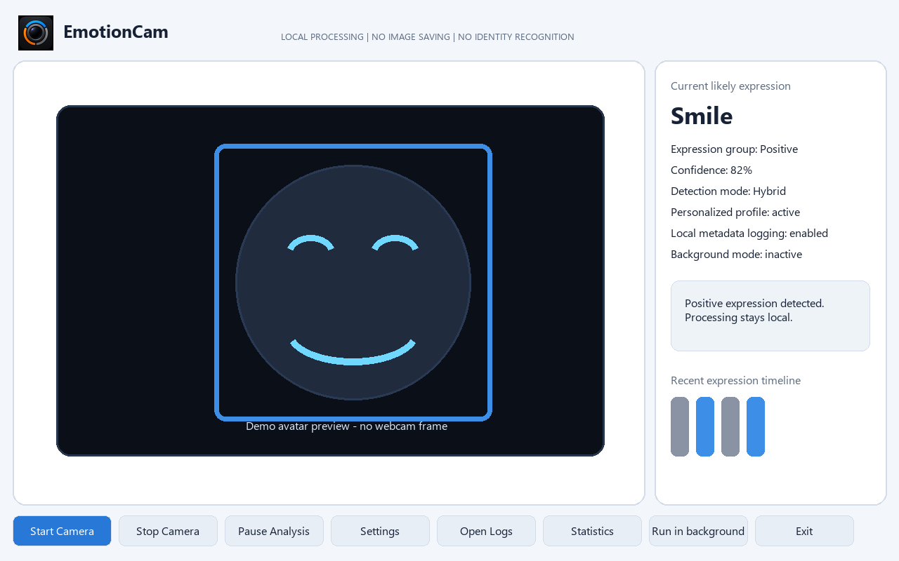

> Placeholder: light dashboard after changing **Settings > Theme > Light** and saving.

## 7. Starting and Stopping Camera

1. Select **Start Camera**.
2. Wait for `Camera running - analysis is local`.
3. Use **Pause Analysis** to pause classification while the preview remains active.
4. Use **Stop Camera** to stop analysis, release the webcam, and remove the last frame.
5. Confirm the preview is black with centered `Camera stopped`.
6. Select **Start Camera** to restart.

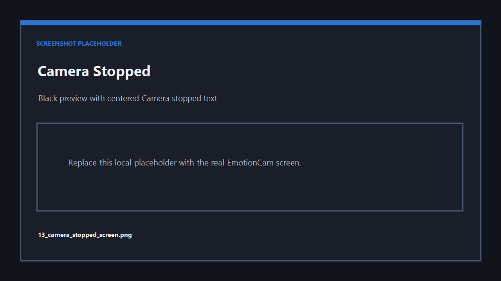

> Placeholder: black stopped-camera screen.

## 8. Expression Detection

Heuristic labels include `neutral`, `happy`, `smile`, `laughing`, `surprised`, `sad`, `angry`, `fearful`, `disgusted`, `confused`, `focused`, `tired`, `unknown`, `low_confidence`, and `no_face`.

Personalized calibration additionally supports `smile_small`, `smile_big`, `amused`, `bored`, `frustrated`, `concerned`, `skeptical`, `thinking`, and `relaxed`.

| Group | Labels |
|---|---|
| Positive | happy, smile, smile_small, smile_big, laughing, amused, surprised |
| Negative | sad, angry, fearful, disgusted, tired, bored, frustrated, concerned |
| Neutral | neutral, focused, confused, skeptical, thinking, relaxed, unknown, low_confidence, no_face |

Confidence is an estimate, not a guarantee. Temporal smoothing and a stable-expression duration reduce flicker. Strong negative labels require more confidence, while uncertain results fall back toward neutral or unknown.

Lighting, blur, distance, glasses, occlusion, and head angle can affect results. MediaPipe landmarks improve moderate-angle handling; OpenCV is a fallback. Calibration helps because it learns local normalized feature patterns from the user's own visible movements.

## 9. Personalized Calibration

Open calibration from **Improve detection with calibration** or **Settings > Train / Calibrate Expressions**.

The unified calibration screen includes:

- Target-expression dropdown
- Local example expression graphic
- Live webcam preview
- Live detected-expression estimate
- Match helper/checkmark
- **Previous**, **Start Capture**, **Re-capture**, **Next**, and **Finish**
- Capture progress, valid/rejected/stored counts, rejection reason, and quality summary

The match helper shows when the current smoothed estimate roughly matches the target or a related expression family. It is guidance only and never blocks capture. Example graphics are local guides and do not need to be copied perfectly.

### Capture an expression

1. Choose a target from the dropdown.
2. Prepare the visible expression.
3. Select **Start Capture**.
4. Review valid/rejected counts and quality.
5. Select **Re-capture** to remove and replace that target's previous batch.
6. Navigate with **Previous**, **Next**, or the dropdown.
7. Select **Finish** after at least one valid target is stored.

The old **Skip** button and separate **Label Unknown Expression** flow were removed. Users now choose the target directly from the unified dropdown.

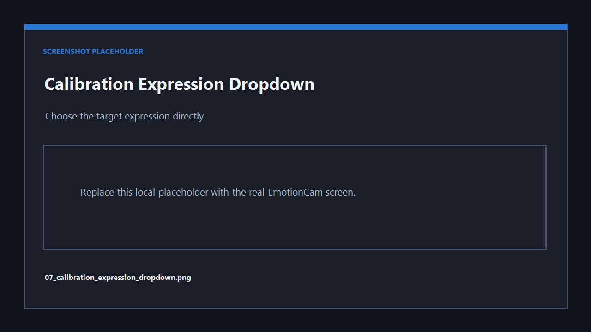
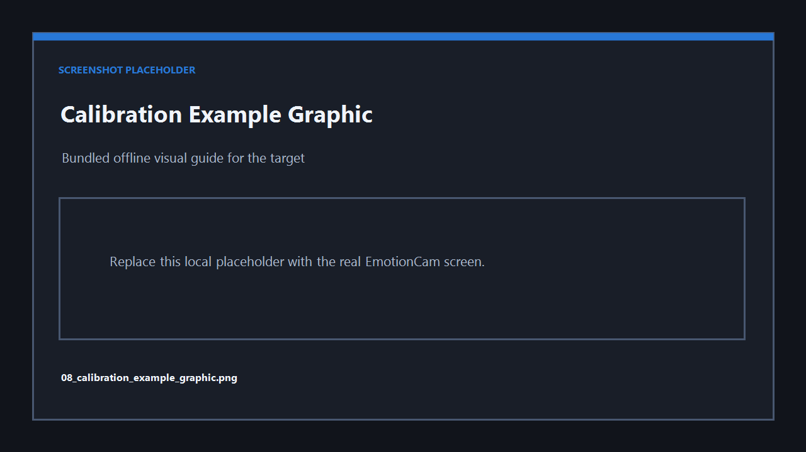
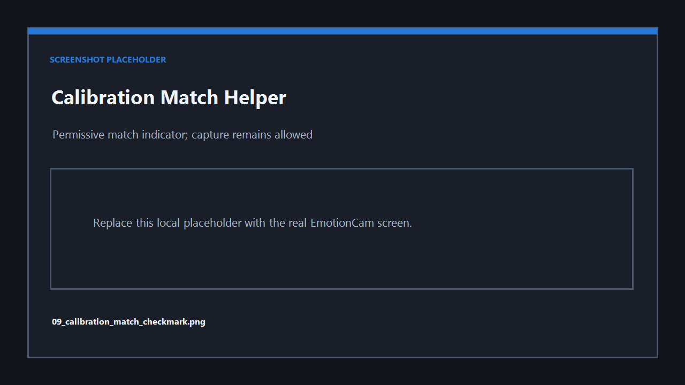

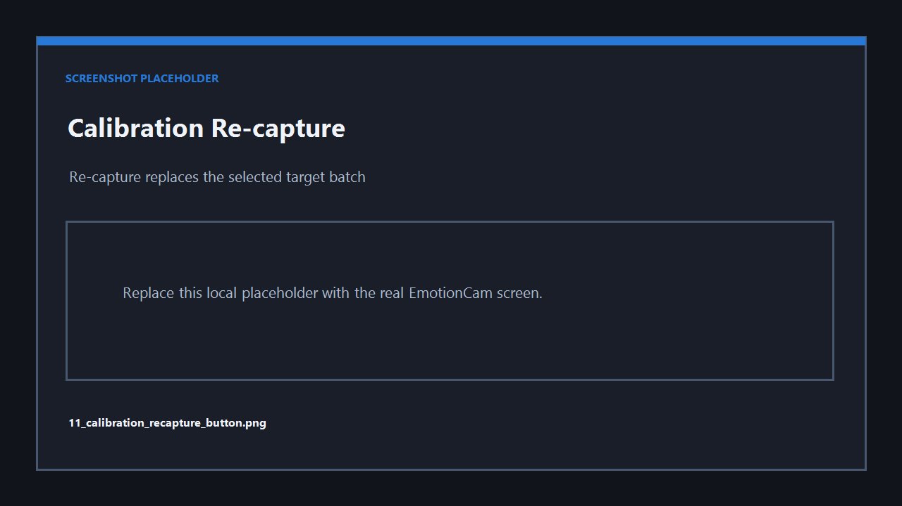
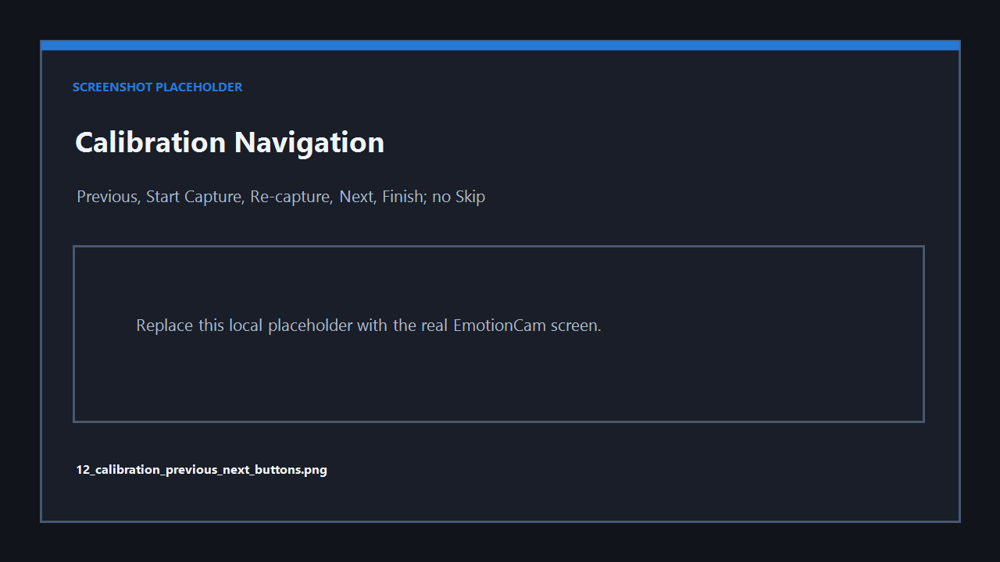

> These are placeholder references until real screenshots are captured.

## 10. Settings

### Appearance and numeric controls

Use **Settings > Appearance > Theme** to select **Dark** or **Light**, then select **Save**. The `theme` choice is saved locally and applied app-wide to the startup screen, dashboard, settings, calibration, menus, buttons, panels, inputs, dropdowns, progress bars, and messages.

All numeric fields are spinner controls. Type a value or use the visible up/down arrow buttons. The arrow area is wide, clickable, and styled for both themes.

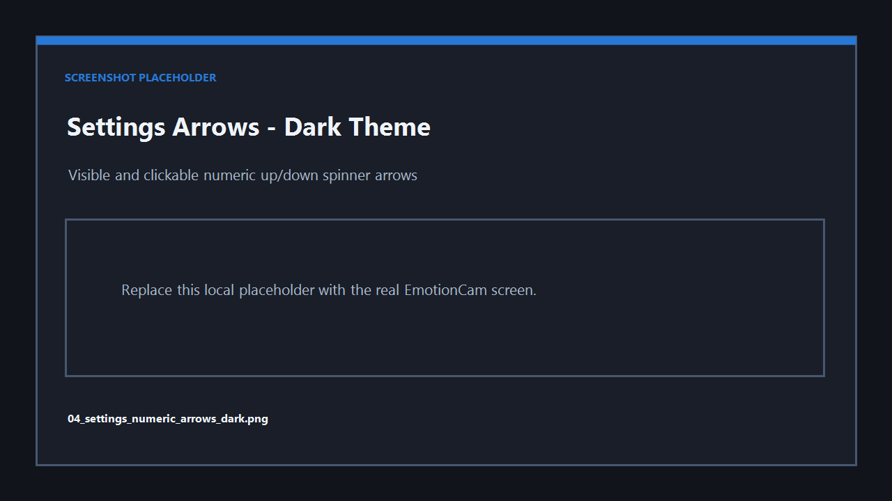
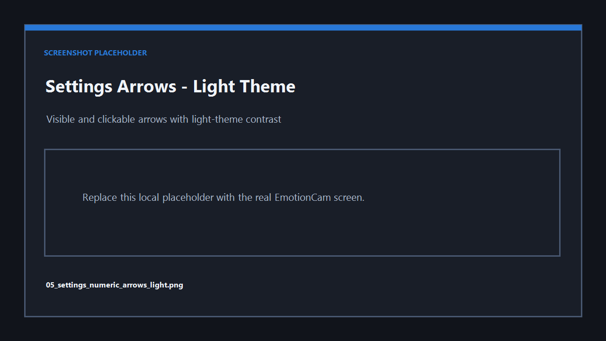
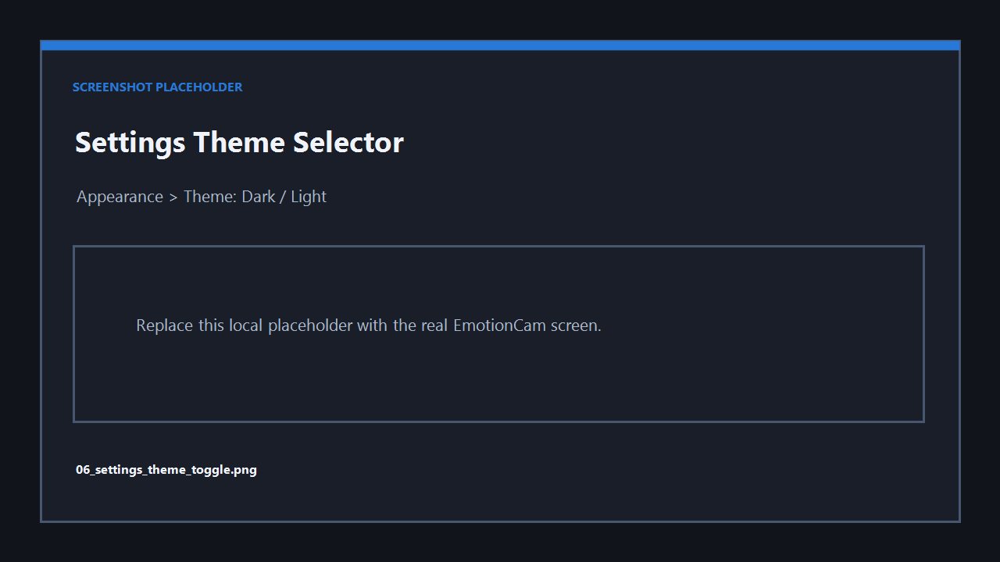

> Placeholder screen examples: capture Settings in both themes with the spinner arrow area visible.

### Actual defaults

| Setting / config key | Default |
|---|---:|
| Theme (`theme`) | `dark` |
| Camera index (`camera_index`) | `0` |
| Detection confidence (`detection_confidence_threshold`) | `0.45` |
| Expression confidence (`expression_confidence_threshold`) | `0.45` |
| Smoothing window (`smoothing_window_seconds`) | `1.5 s` |
| Stable expression (`stable_expression_seconds`) | `0.8 s` |
| Message cooldown (`message_cooldown_seconds`) | `8 s` |
| Face-missing grace (`face_missing_grace_seconds`) | `1.0 s` |
| Negative minimum confidence | `0.65` |
| Positive minimum confidence | `0.50` |
| Show face rectangle / confidence / messages | On |
| Local metadata logging | On |
| Background popups | On |
| Negative popup cooldown | `600 s` |
| Positive recovery cooldown | `300 s` |
| Debug panel | Off |
| Detection mode | `heuristic` initially; Hybrid after calibration |
| Personalized profile enabled | On |
| Calibration target samples | `45` |
| Calibration capture duration | `4.0 s` |
| Calibration preparation countdown | `2.0 s` stored; current capture is manual |
| Minimum good samples | `15` |
| Store raw calibration images | Off |
| External AI backend | Off and disabled |

Settings also provide local profile train/retrain/add/delete/export/import controls, log controls, and reset-to-default.

## 11. Background Mode

Select **Run in background** to keep camera analysis and optional metadata logging active locally. EmotionCam hides to the Windows tray when available, or minimizes to the taskbar.

The tray menu contains **Show EmotionCam**, **Stop Camera**, and **Exit**. Double-click the tray icon to restore the app.

With background popups enabled, a stable negative group can show a cooldown-controlled supportive notification. A later stable positive group can show a positive-recovery notification. These are expression estimates, not diagnoses.

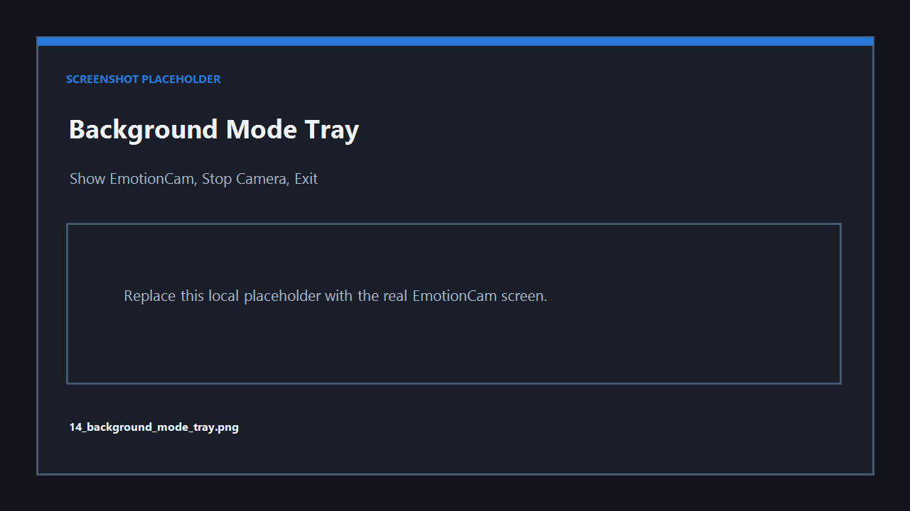

> Placeholder: tray icon and menu.

## 12. Logs and Local Data

| Data | Actual path |
|---|---|
| Configuration | `%LOCALAPPDATA%\EmotionCam\config.json` |
| Metadata history | `%LOCALAPPDATA%\EmotionCam\logs\expression_history.jsonl` |
| Personalized profile | `%LOCALAPPDATA%\EmotionCam\profile\expression_profile.json` |
| User profile and email-summary preferences | `%LOCALAPPDATA%\EmotionCam\profile\user_profile.json` |
| Optional debug calibration frames | `%LOCALAPPDATA%\EmotionCam\profile\debug_images\` |

The JSONL log stores timestamp, expression label/group, confidence, detection mode, classifier source, profile-active status, face-detected status, displayed message, popup status, and FPS. It does not save frame/image fields or identity data.

Use **Open Logs**, **Clear Logs**, or disable local logging in Settings. Use Settings to retrain, export, import, or delete the personalized profile.

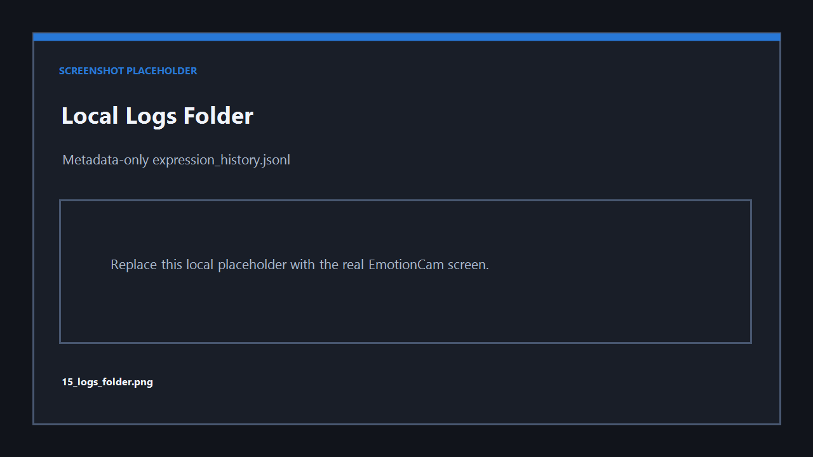

> Placeholder: local logs folder.

## 13. Statistics

Select **Statistics** on the dashboard to open local visual summaries generated
only from expression metadata logs. Bad JSONL lines, old fields, missing values,
unknown expressions, and empty histories are handled without crashing.

The Statistics window includes:

- Date selector, Today, Last 7 days, Refresh, and Export Summary controls
- Positive / neutral / serious-expression balance for the selected day
- Daily expression-group timeline
- Expression counts by label
- Last-7-days balance chart
- Most frequent expression, valid entry count, estimated analyzed minutes
- Most positive and most serious-expression periods when available

Charts follow the selected dark or light theme. Export Summary writes a local
text summary. Statistics are approximate visible-expression estimates, not
diagnoses.

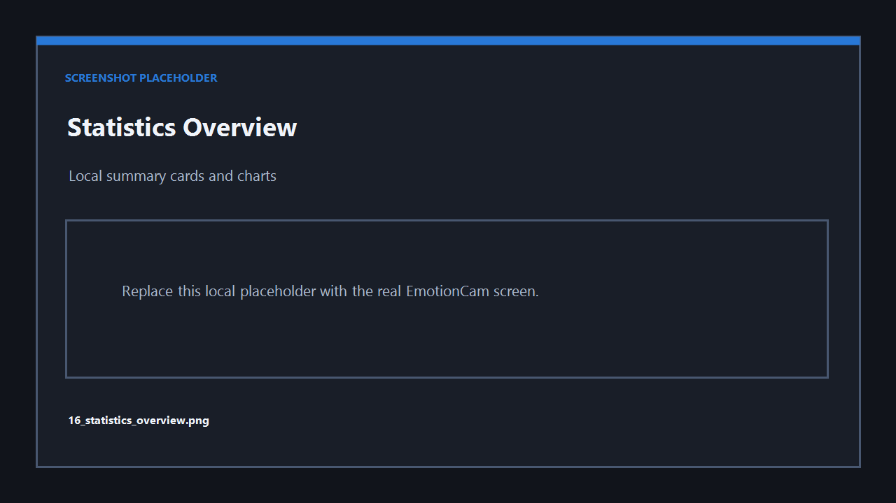
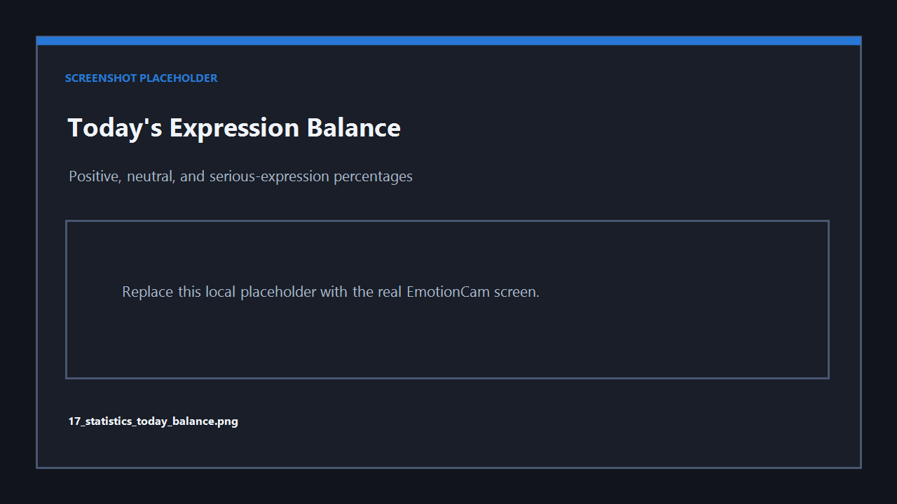
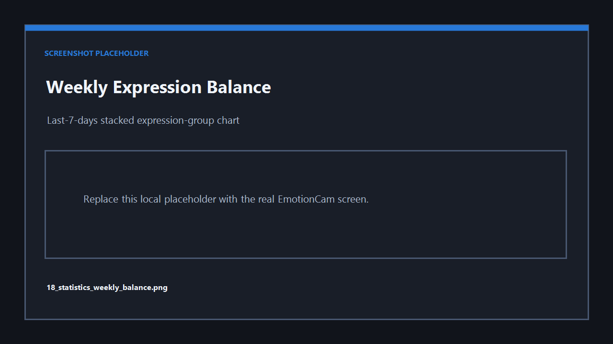
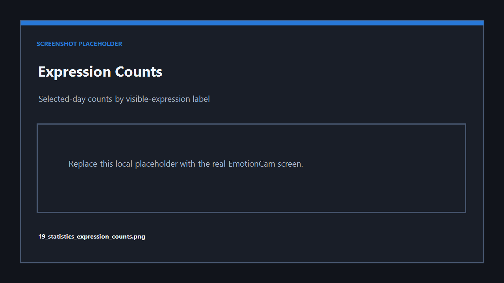

> Placeholder: Statistics window with summary cards and charts.

## 14. User Profile and Optional Daily Email

Settings and the calibration header include optional **User name** and **Email
address** fields. The name can personalize safe app messages; leaving it blank
keeps generic wording. Only the minimal profile fields are stored locally.

Daily email summaries are **off by default** and require explicit opt-in. They
send only local statistics text. No images or webcam frames are sent.

Delivery choices:

- **Default mail client draft:** opens a pre-filled draft for manual review/send.
  It never sends automatically.
- **SMTP automatic sending:** can send while the app is running at/after the
  configured time, including background mode. It requires an email, SMTP server,
  port, username, password, and optional TLS.

SMTP passwords are never written to `user_profile.json`. When Windows credential
storage through `keyring` is available, the password can be stored securely;
otherwise it remains session-only and must be entered again.

The app sends at most one SMTP summary per date, only when logs exist. A missed
summary can be sent when the app next starts. Use **Send Test Email / Open Test
Draft** before enabling automatic delivery.

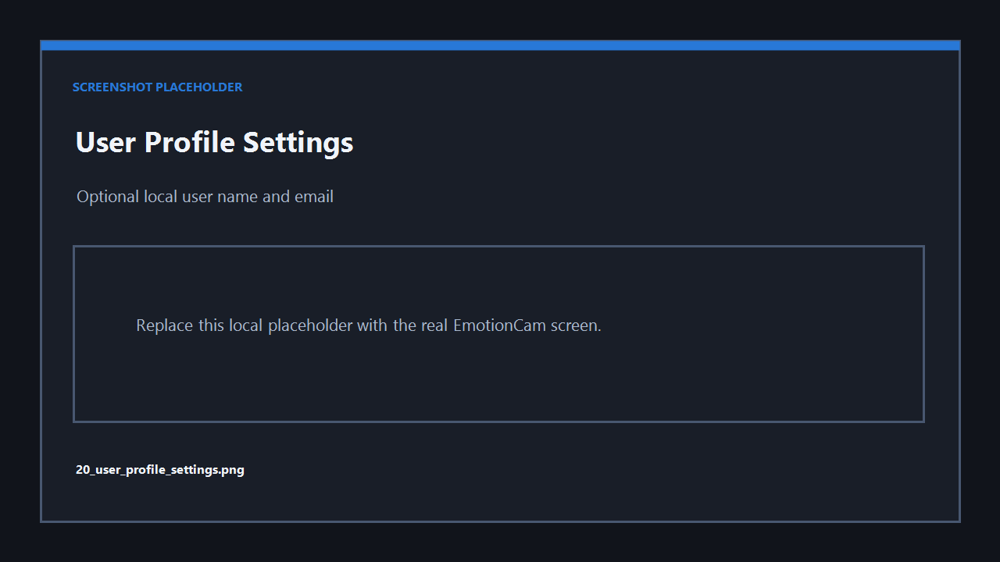
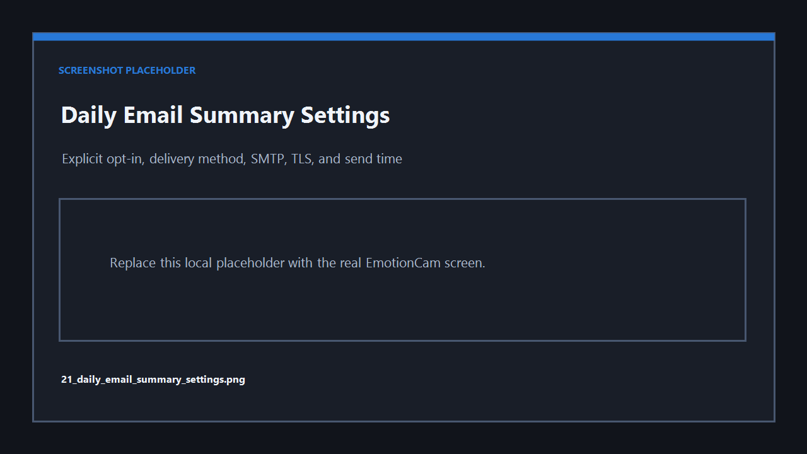


> Placeholder: User Profile and Daily Email Summary settings.

## 15. Complete Demo Walkthrough

Start from **Help > Start Demo Guide**, or open `docs\START_DEMO_HERE.html`.

| # | What to click/do | What should appear | Expected result / screenshot |
|---:|---|---|---|
| 1 | Launch EmotionCam | Simplified lens icon and startup screen | `01_startup_screen.png` |
| 2 | Point out the icon | Same icon in app/taskbar | Branding is consistent |
| 3 | Review startup privacy text | Logging choice and local-processing notice | No camera yet |
| 4 | Select Start Camera | Dark dashboard and preview | `02_main_dashboard_dark_theme.png` |
| 5 | Hold neutral, then smile | Estimate changes; positive group turns rectangle blue | `02_main_dashboard_dark_theme.png` |
| 6 | Open Settings | Scrollable settings dialog | Settings visible |
| 7 | Click numeric up/down arrows and type a value | Spinner changes both ways | `04_settings_numeric_arrows_dark.png` |
| 8 | Choose Theme: Light and Save | Entire app becomes light | `03_main_dashboard_light_theme.png` |
| 9 | Optionally switch back to Dark | Entire app returns dark | `06_settings_theme_toggle.png` |
| 10 | Open calibration | Unified calibration screen | `07_calibration_expression_dropdown.png` |
| 11 | Select an expression from dropdown | Target changes | `07_calibration_expression_dropdown.png` |
| 12 | Point out local example graphic | Graphic changes with target | `08_calibration_example_graphic.png` |
| 13 | Perform a roughly matching expression | Helper match may appear | `09_calibration_match_checkmark.png` |
| 14 | Select Start Capture | Local feature capture starts | `10_calibration_capture_progress.png` |
| 15 | Show capture progress | Counts and quality update | `10_calibration_capture_progress.png` |
| 16 | Select Re-capture | Current target batch is removed/reset | `11_calibration_recapture_button.png` |
| 17 | Use Previous and Next | Target moves in both directions | `12_calibration_previous_next_buttons.png` |
| 18 | Capture valid samples and Finish | Completion message/profile saved | Profile activates |
| 19 | Return to dashboard | Hybrid mode/profile active | Dashboard status |
| 20 | Select Run in background | Tray icon/menu; analysis continues locally | `14_background_mode_tray.png` |
| 21 | Restore app and select Statistics | Local cards and charts | `16_statistics_overview.png` |
| 22 | Show today's balance, weekly chart, and expression counts | Local-only visual summaries | `17_statistics_today_balance.png`, `18_statistics_weekly_balance.png`, `19_statistics_expression_counts.png` |
| 23 | Open Settings / User Profile, enter a name, save, and show a personalized message | Optional local name affects safe wording | `20_user_profile_settings.png` |
| 24 | Enter email and explain disabled-by-default daily email summary / Send Test control | Opt-in privacy wording | `21_daily_email_summary_settings.png`, `22_test_email_button.png` |
| 25 | Select Open Logs | Metadata-only logs folder | `15_logs_folder.png` |
| 26 | Select Exit | Camera released and app closes | Demo complete |

See [START_DEMO_HERE.html](START_DEMO_HERE.html) and [demo_script.md](demo_script.md).

## 16. Troubleshooting

| Issue | What to try |
|---|---|
| Camera will not start | Allow desktop-app camera access and close other webcam apps. |
| No face detected | Improve lighting, face the camera, move closer, and remove occlusion. |
| Estimate is wrong | Hold steady, reduce head angle, enable Debug, and calibrate. |
| Too few calibration samples | Improve light/position, hold still, or increase capture duration. |
| Spinner arrows do not appear | Restart the updated app/build; confirm the current theme applies and no old executable is running. |
| Theme does not change | Select the theme and then **Save**; the choice is stored in local config. |
| Background popup does not show | Enable popups, allow Windows notifications, and wait for cooldown. |
| Logs are missing | Enable local metadata logging and run analysis briefly. |
| Statistics are empty | Enable logging, run analysis, refresh, and select a date with entries. |
| Daily email is not sent | Confirm explicit opt-in, valid email, SMTP settings/password, logs for the date, send time, and network access. |
| Installer is blocked | Verify the source before using SmartScreen **More info > Run anyway**. |
| Source dependencies are missing | Activate `.venv` and run `python -m pip install -r requirements.txt`. |

## 17. Limitations

- Visible-expression estimates are approximate and can be wrong.
- Lighting, blur, occlusion, distance, and head angle affect results.
- Personalized calibration improves estimates but does not guarantee accuracy.
- The app is designed for one user and one laptop webcam.
- The match helper is permissive guidance and does not validate a true emotion.
- The preparation-countdown config remains, but capture currently starts manually.
- EmotionCam does not know true feelings and is not for high-stakes decisions.
- Estimated analyzed minutes use log-entry frequency and are approximate.
- Email summaries require network access only when explicitly enabled or a draft is opened.

## 18. Uninstall and Data Removal

Uninstall from **Windows Settings > Apps > Installed apps > EmotionCam > Uninstall**.

To remove all remaining local settings, logs, profile features, and optional debug calibration frames, fully exit EmotionCam and delete:

```text
%LOCALAPPDATA%\EmotionCam
```

## 19. How to Start the Demo

1. Install or run EmotionCam.
2. Open the app.
3. Select **Help > Start Demo Guide**.
4. Follow the offline `docs\START_DEMO_HERE.html` page.

Directly opening `docs\START_DEMO_HERE.html` also works without internet access.
