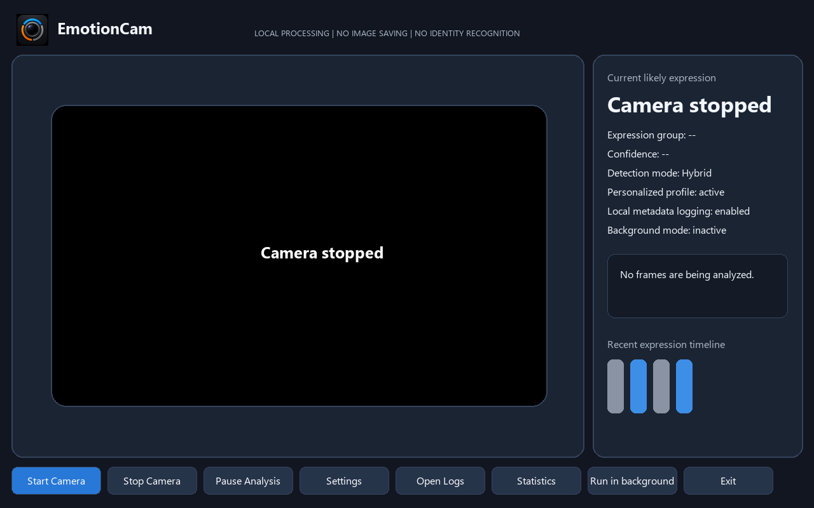
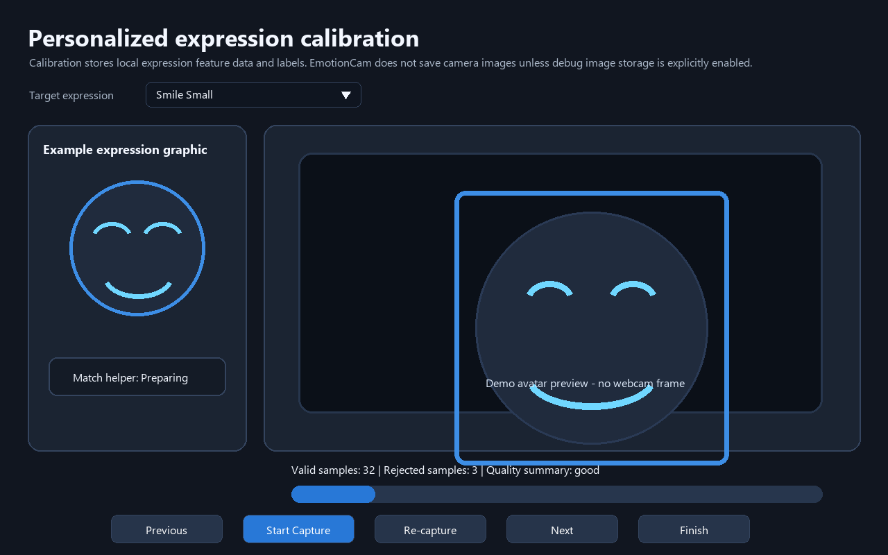
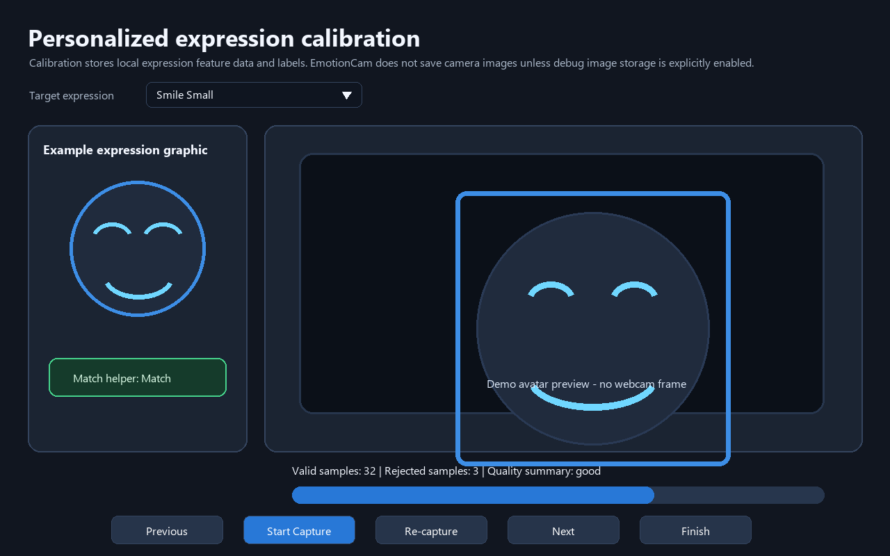
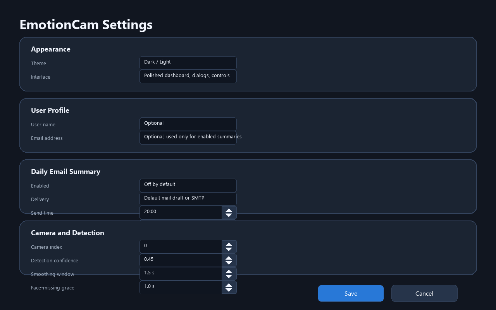
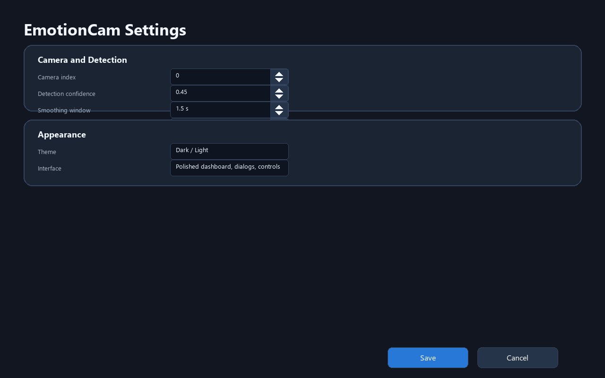
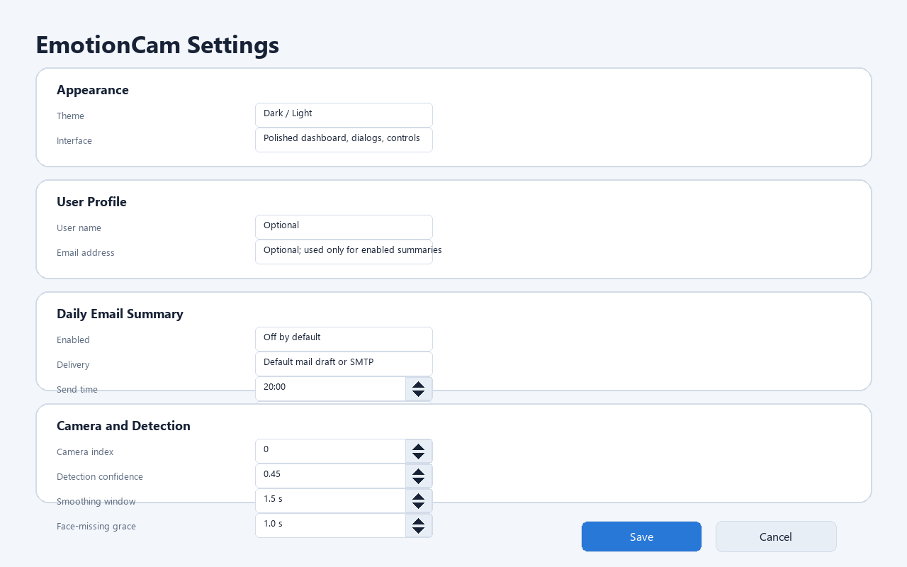
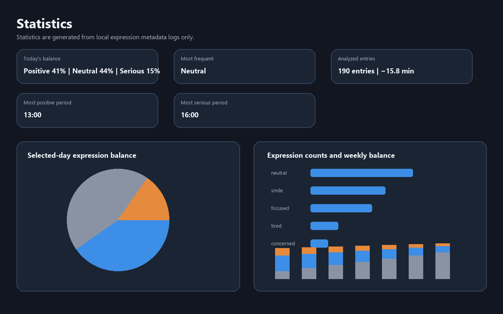
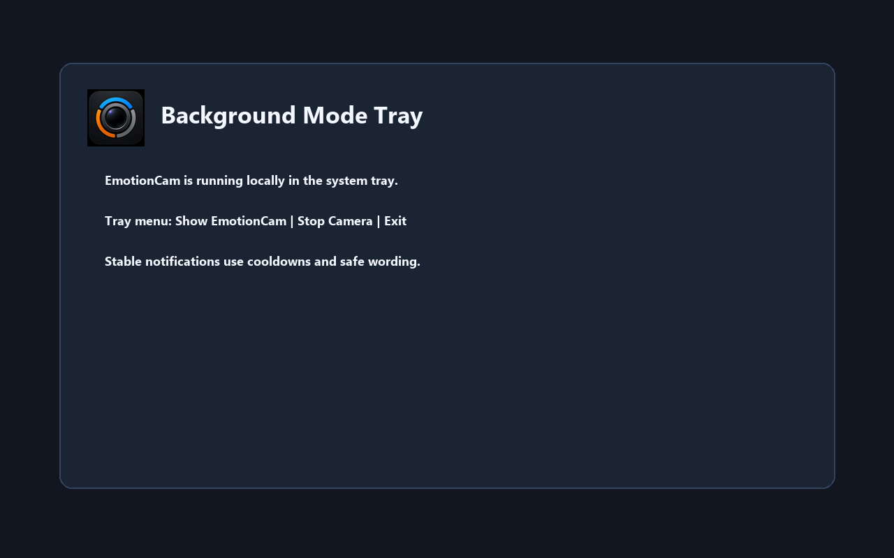
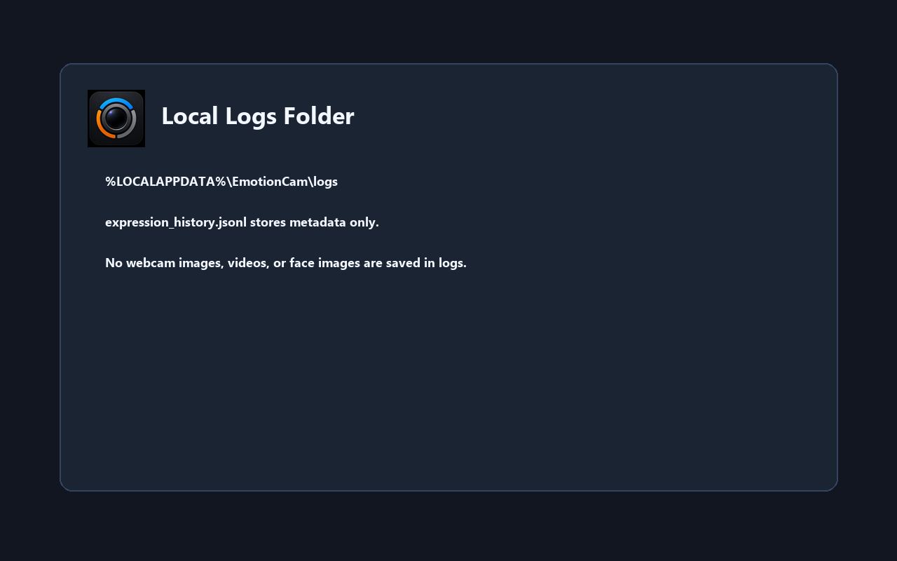

# EmotionCam User Manual


**EmotionCam 1.0.0**  
Local visible-expression estimates with privacy-first personalized calibration  
Updated June 16, 2026

> EmotionCam estimates visible facial expressions. It does not know or
> guarantee a person's true emotions.

## 1. Introduction

EmotionCam is a Windows desktop app for one person using a laptop webcam. It
shows a local camera preview, estimates visible facial expressions, smooths the
result, and displays a label, group, confidence estimate, safe interaction
message, and recent timeline.

EmotionCam can also be personalized through local calibration, run in the
Windows tray, save metadata-only logs, show local Statistics, and optionally send
daily text summaries when explicitly enabled.

## 2. Privacy and Safety

- Webcam frames are processed locally by default.
- EmotionCam does not identify people or perform face matching.
- There is no account system, telemetry, analytics, automatic screenshot, or
  video-recording feature.
- Metadata logs contain expression labels/groups, confidence, status, messages,
  popup status, and FPS.
- Calibration stores local normalized feature data and labels.
- Raw calibration frames are not saved unless the explicit debugging option is
  enabled.
- Daily email summaries are off by default and send text only if enabled.

Do not use EmotionCam for medical, psychological, legal, hiring, security,
surveillance, or lie-detection decisions.

## 3. Installation

### Install the packaged app

1. Open the repository Releases page.
2. Download `EmotionCam_Setup.exe` from the latest release.
3. Run the installer.
4. Launch EmotionCam from the Start Menu or optional desktop shortcut.
5. Allow Windows camera access for desktop apps if prompted.

The app installs per user under:

```text
%LOCALAPPDATA%\Programs\EmotionCam
```

The installer is unsigned, so Windows SmartScreen may show a warning. Choose
**More info > Run anyway** only if you trust the downloaded file.

### Run from source

```powershell
py -3.12 -m venv .venv
.\.venv\Scripts\Activate.ps1
python -m pip install --upgrade pip
python -m pip install -r requirements.txt
python -m app.main
```

## 4. First Launch

The startup screen shows the local-processing privacy notice, approximation
notice, metadata-history checkbox, **Start Camera**, **Settings**, and **Exit**.


## 5. Main Dashboard

The dashboard contains the camera preview, face rectangle, current likely
expression, expression group, confidence, interaction message, timeline, logging
status, privacy status, detection mode, personalized profile status, Statistics,
Settings, Open Logs, Run in background, and Exit controls.

Rectangle colors use the smoothed expression group:

- Blue: positive
- Orange: negative
- Gray: neutral, unknown, low confidence, or no face


## 6. Starting and Stopping the Camera

1. Click **Start Camera**.
2. Wait for the dashboard preview and local analysis status.
3. Use **Pause Analysis** to pause classification while the preview remains
   active.
4. Click **Stop Camera** to stop analysis, release the camera, and clear the
   last frame.
5. The preview shows a black `Camera stopped` screen.
6. Click **Start Camera** again to restart.



## 7. Expression Detection

Heuristic labels include `neutral`, `happy`, `smile`, `laughing`, `surprised`,
`sad`, `angry`, `fearful`, `disgusted`, `confused`, `focused`, `tired`,
`unknown`, `low_confidence`, and `no_face`.

Personalized calibration also supports `smile_small`, `smile_big`, `amused`,
`bored`, `frustrated`, `concerned`, `skeptical`, `thinking`, and `relaxed`.

| Group | Labels |
|---|---|
| Positive | happy, smile, smile_small, smile_big, laughing, amused, surprised |
| Negative | sad, angry, fearful, disgusted, tired, bored, frustrated, concerned |
| Neutral | neutral, focused, confused, skeptical, thinking, relaxed, unknown, low_confidence, no_face |

Confidence is an estimate. Temporal smoothing and stable-expression timing
reduce flicker. Strong negative labels require higher confidence, while
uncertain results fall back toward neutral or unknown.

## 8. Personalized Calibration

Open calibration from **Improve detection with calibration** or **Settings >
Train / Calibrate Expressions**.

The calibration screen includes:

- Target expression dropdown
- Local example expression graphic
- Demo/live preview area
- Live detected-expression estimate
- Match helper/checkmark
- **Previous**, **Start Capture**, **Re-capture**, **Next**, and **Finish**
- Progress, valid sample count, rejected sample count, and quality summary

The old **Skip** button and separate **Label Unknown Expression** flow were
removed. Users now choose the target expression directly from the dropdown.






## 9. Settings

Settings include Appearance, User Profile, Daily Email Summary, Camera and
Detection, Personalized calibration, Background, Privacy/logging, and Debug
options.

Use **Appearance > Theme** to switch between Dark and Light. The theme is saved
locally and applies across the dashboard, Settings, calibration, Statistics,
buttons, inputs, progress bars, and message areas.

All numeric fields use spinner controls. You can type values or use the visible
up/down arrows.








## 10. Statistics

Click **Statistics** on the dashboard to open local visual summaries generated
from expression metadata logs only.

The Statistics window includes:

- Selected-day positive / neutral / serious-expression balance
- Daily expression-group timeline
- Expression counts by label
- Last-7-days balance
- Most frequent expression
- Approximate analyzed entries/minutes
- Most positive and most serious-expression periods when available
- Refresh and Export Summary controls




## 11. User Profile and Optional Daily Email

Settings and calibration include optional **User name** and **Email address**
fields. The name can personalize safe messages. Email is used only for the
optional daily summary feature.

Daily email summaries are disabled by default. If enabled, they send local
statistics text only. No webcam frames, face images, videos, raw calibration
images, or identity data are included.

Delivery modes:

- Default mail client draft: opens a draft for manual review/send.
- SMTP automatic sending: sends at the configured time when the app is running
  and logs exist.

SMTP passwords are not stored in profile JSON. When Windows credential storage
through `keyring` is available, the password can be stored securely.


## 12. Background Mode

Click **Run in background** to keep camera analysis and optional metadata logging
active locally while the app hides to the tray when available. The tray menu can
show EmotionCam, stop the camera, or exit.

Stable serious-expression estimates can show cooldown-controlled supportive
notifications. A later positive shift can show a recovery notification. These
are visible-expression estimates, not diagnoses.



## 13. Logs and Local Data

| Data | Path |
|---|---|
| Settings | `%LOCALAPPDATA%\EmotionCam\config.json` |
| Metadata logs | `%LOCALAPPDATA%\EmotionCam\logs\expression_history.jsonl` |
| Personalized profile | `%LOCALAPPDATA%\EmotionCam\profile\expression_profile.json` |
| User profile and email preferences | `%LOCALAPPDATA%\EmotionCam\profile\user_profile.json` |
| Optional debug calibration images | `%LOCALAPPDATA%\EmotionCam\profile\debug_images\` |

Logs are metadata-only and never include webcam frame data.



## 14. Demo Walkthrough

1. Launch EmotionCam and show the icon/startup privacy screen.
2. Start the camera and explain visible-expression estimates.
3. Show neutral and positive states; point out the blue positive rectangle.
4. Stop the camera and show `Camera stopped`.
5. Open Settings and demonstrate spinner arrows.
6. Switch Dark to Light and optionally back to Dark.
7. Open calibration and choose an expression from the dropdown.
8. Show the local example graphic and match helper.
9. Use Start Capture, Re-capture, Previous, Next, and Finish.
10. Return to the dashboard and show personalized/hybrid status.
11. Run in background and explain tray behavior.
12. Open Statistics and show local charts.
13. Show User Profile and disabled-by-default email summary settings.
14. Open Logs and close the app.

For a presenter-ready version, open [START_DEMO_HERE.html](START_DEMO_HERE.html).

## 15. Troubleshooting

| Issue | What to try |
|---|---|
| Camera will not start | Allow desktop-app camera access and close other webcam apps. |
| No face detected | Improve lighting, face the camera, move closer, and remove occlusion. |
| Estimate is wrong | Hold steady, reduce head angle, enable Debug, and calibrate. |
| Calibration has too few samples | Improve lighting, hold still, or increase capture duration. |
| Background popups do not show | Enable popups, allow Windows notifications, and wait for cooldown. |
| Statistics are empty | Enable logging, run analysis briefly, refresh, and select a date with entries. |
| Daily email is not sent | Confirm opt-in, valid email, SMTP settings/password, logs, send time, and network access. |
| Installer is blocked | Use SmartScreen **More info > Run anyway** only for a trusted file. |

## 16. Limitations

- Detection is approximate and may be wrong.
- Lighting, blur, occlusion, distance, and head angle affect results.
- Calibration improves estimates but cannot guarantee accuracy.
- The app is designed for one visible user and one laptop webcam.
- Email summaries require network access only after explicit opt-in.

## 17. Uninstall and Data Removal

Uninstall from **Windows Settings > Apps > Installed apps > EmotionCam**.

To remove remaining local settings, logs, calibration data, and optional debug
frames, fully exit EmotionCam and delete:

```text
%LOCALAPPDATA%\EmotionCam
```
